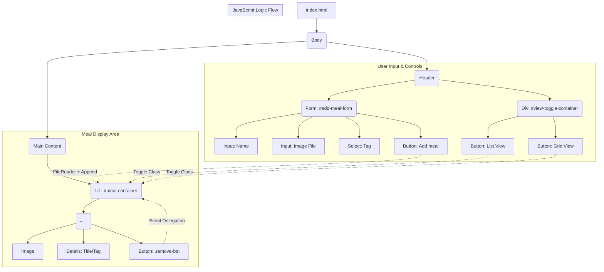

# Assignment 01 - My Food Journal

## Brief

Starting from the concept of a pinboard, implement a web page that:

- is responsive (properly layout for smartphone, tablet, and desktop)
- allows the user to add and remove elements
- allows the user to customize elements (i.e. colors, size)
- allows the switch between two views (at least)

## Final result
![Mobile-List-view] (DOC/Mobile-List-view)
![Mobile-Card-view] (DOC/Mobile-Card-view)
![Desktop-List-view] (DOC/Desktop-List-view)
![Desktop-Card-view] (DOC/Desktop-Card-view)

## Project description
"My Food Journal" is a web application designed for users to easily track, categorize, and visualize their meals. Built purely with HTML, custom CSS, and JavaScript, the application focuses on providing a clean, responsive, and intuitive interface for quick data entry and meal management.

## Block diagram

## Function

##### listButton.clickHandler
- Argument: none
- Description: toggles the display mode of the #meal-container to list-view. It removes the grid-view class, adds the list-view & updates the active state of the toggle buttons.
- Returns: none

##### gridButton.clickHandler
- Argument: none
- Description: toggles the display mode of the #meal-container to grid-view. It removes the list-view class, adds the grid-view & updates the active state of the toggle buttons.
- Returns: none

##### addForm.submitHandler
- Argument: event
- Description: handles the form submission. It calls event.preventDefault() to stop the page from reloading and then executes the addMeal() function.
- Returns: none
  
##### mealContainer.clickHandler
- Argument: event
- Description: It listens for any click within the meal container. If the clicked element is a .remove-btn, it finds the closest parent <li> (the meal card) and removes it from the DOM.
- Returns: none
- 
##### add.Meal
- Argument: none
- Description: The main function for creating and adding a new meal card. It reads form data, checks for a file input, and uses the FileReader API to convert the local image file into a Data URL for immediate display in the  tag. Finally, it resets the form.
- Returns: return (--> exits the function) if the imgInput does not contain a file, after showing an alert.

## Content & data sources
none
  
