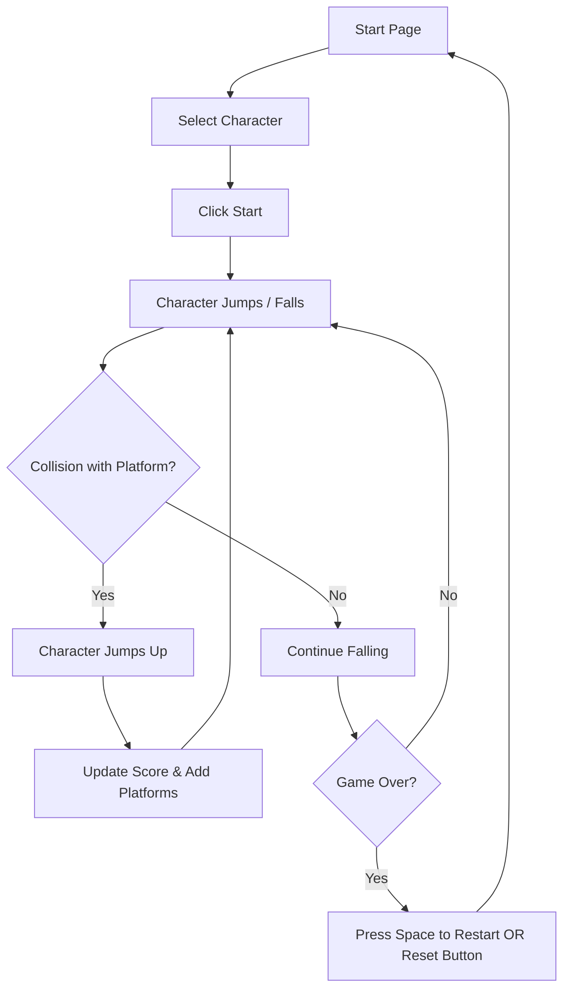

# Assignment 02 - Doodle Jump Game

## Brief

Choose a “mini-game” to rebuild with HTML, CSS and JavaScript. The requirements are:

- The webpage should be responsive
- Choose an avatar at the beginning of the game
- Keep track of the score of the player
- Use the keyboard to control the game (indicate what are the controls in the page). You can also use buttons (mouse), but also keyboard.
- Use some multimedia files (audio, video, …)
- Implement an “automatic restart” in the game (that is not done via the refresh of the page)

## Final result

## Project description
"Doodle" is a mobile app game.

## Block diagram

## Function

##### listButton.clickHandler
- Argument: none
- Description: toggles the display mode of the #meal-container to list-view. It removes the grid-view class, adds the list-view & updates the active state of the toggle buttons.
- Returns: none

##### gridButton.clickHandler
- Argument: none
- Description: toggles the display mode of the #meal-container to grid-view. It removes the list-view class, adds the grid-view & updates the active state of the toggle buttons.
- Returns: none

##### addForm.submitHandler
- Argument: event
- Description: handles the form submission. It calls event.preventDefault() to stop the page from reloading and then executes the addMeal() function.
- Returns: none
  
##### mealContainer.clickHandler
- Argument: event
- Description: It listens for any click within the meal container. If the clicked element is a .remove-btn, it finds the closest parent <li> (the meal card) and removes it from the DOM.
- Returns: none
- 
##### add.Meal
- Argument: none
- Description: The main function for creating and adding a new meal card. It reads form data, checks for a file input, and uses the FileReader API to convert the local image file into a Data URL for immediate display in the  tag. Finally, it resets the form.
- Returns: return (--> exits the function) if the imgInput does not contain a file, after showing an alert.

## Content & data sources
none
  
