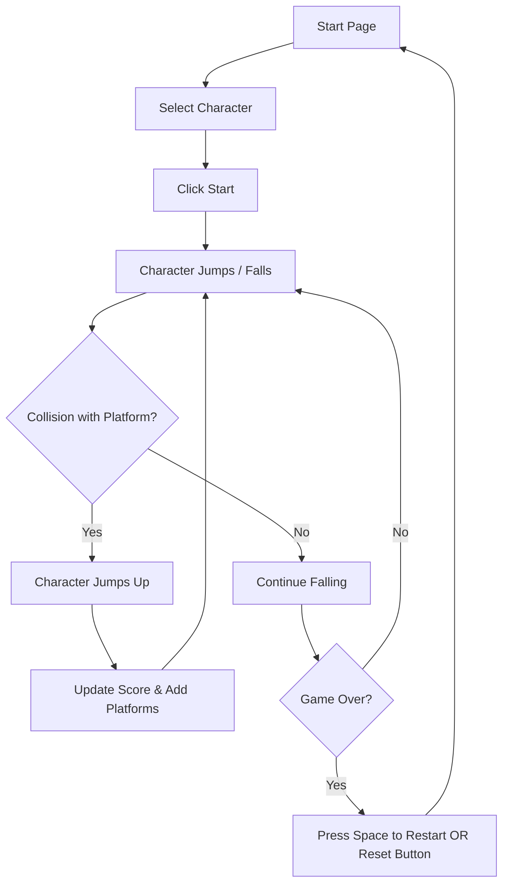

# Assignment 02 - Doodle Jump Game

## Brief

Choose a “mini-game” to rebuild with HTML, CSS and JavaScript. The requirements are:

- The webpage should be responsive
- Choose an avatar at the beginning of the game
- Keep track of the score of the player
- Use the keyboard to control the game (indicate what are the controls in the page). You can also use buttons (mouse), but also keyboard.
- Use some multimedia files (audio, video, …)
- Implement an “automatic restart” in the game (that is not done via the refresh of the page)

## Final result
)

)

## Project description
"Doodle Jump", is an app from 2009, is a simple, endless jumping game with a hand-drawn look. The goal is to jump on platforms and keep climbing, making sure not to fall down.

I recreated this mini-game with my own touches! 
You move left and right using the arrow keys or the A and D keys.

## Block diagram

## Functions

##### generatePlatforms
- Parameters: none
- Expression logic: initializes the platforms array. It first adds a starting platform near the bottom center of the canvas. Then, it iterates to add the remaining platforms (totalPlatforms - 1), placing them at random horizontal positions and stacked vertically above the previous one with a 50-pixel gap.
- Return values: none (modifies the global platforms array)

##### detectCollision
- Parameters: player, platform
- Expression logic: checks if the player object (Doodler) is colliding with the platform object. Specifically, it uses bounding box collision logic and also requires that the Doodler is moving downwards (velocityY > 0), ensuring collision only occurs when falling onto a platform from above.
- Return values: a boolean (true if collision is detected under the specified conditions, false otherwise)

##### update
- Parameters: none
- Expression logic: this is the main game loop function, typically called using requestAnimationFrame. It clears the canvas, updates the Doodler's position based on velocityX and gravity-affected velocityY. It checks for collisions, scrolls platforms and updates the score if the Doodler goes above the screen center, draws the Doodler and platforms, manages platform creation/removal, and checks for the game over condition (Doodler falls off the bottom).
- Return values: none (calls itself recursively via requestAnimationFrame)
