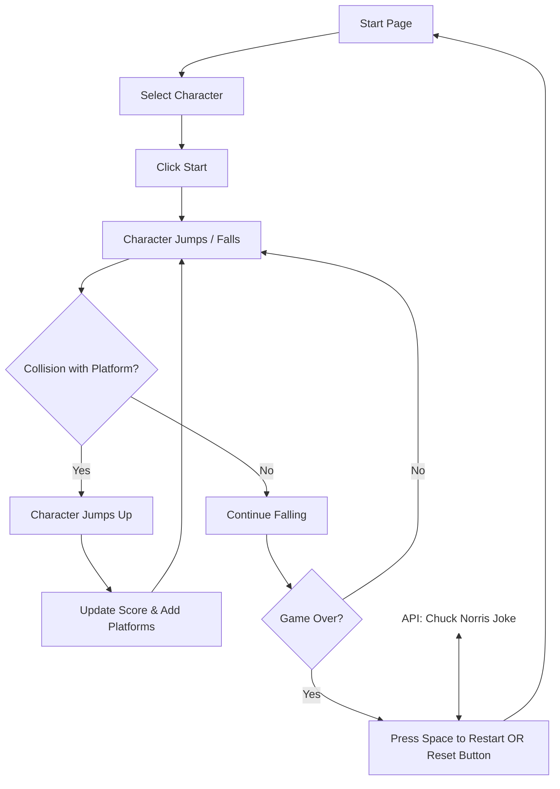

# Assignment 03 - Doodle Jump Game ft. Chuck Norris

## Brief

Upgrade the Assignment 02 by adding the use of data coming from an external web API. For example, fetch contents (audio, images, video, text, metadata) from online archives, AI generated contents (chatGPT API), data (weather, realtime traffic data, environmental data).

The application **must** have those requirements:

- The webpage is responsive
- Use a web API (you choose which one best fists for your project) to load the data and display them in the webpage
- At least one multimedia file (for user feedback interactions, or content itself)
- Develop a navigation system that allows the user to navigate different sections with related content and functionalities

## Final result

## Project description
"Doodle Jump", is an app from 2009, is a simple, endless jumping game with a hand-drawn look. The goal is to jump on platforms and keep climbing, making sure not to fall down.

I recreated this mini-game with my own touches! 
You move left and right using the arrow keys or the A and D keys.
When you fall down the game is over and a Chuck Norris joke appears for 5 seconds on the game.

## Block diagram

## Functions

##### generatePlatforms
- Parameters: none
- Expression logic: initializes the platforms array. It first adds a starting platform near the bottom center of the canvas. Then, it iterates to add the remaining platforms (totalPlatforms - 1), placing them at random horizontal positions and stacked vertically above the previous one with a 50-pixel gap.
- Return values: none (modifies the global platforms array)

##### detectCollision
- Parameters: player, platform
- Expression logic: checks if the player object (Doodler) is colliding with the platform object. Specifically, it uses bounding box collision logic and also requires that the Doodler is moving downwards (velocityY > 0), ensuring collision only occurs when falling onto a platform from above.
- Return values: a boolean (true if collision is detected under the specified conditions, false otherwise)

##### update
- Parameters: none
- Expression logic: this is the main game loop function, typically called using requestAnimationFrame. It clears the canvas, updates the Doodler's position based on velocityX and gravity-affected velocityY. It checks for collisions, scrolls platforms and updates the score if the Doodler goes above the screen center, draws the Doodler and platforms, manages platform creation/removal, and checks for the game over condition (Doodler falls off the bottom). Inside the if (doodler.y > canvas.height) block, after setting gameOver = true and gameRunning = false (which should run only once per game over), it must call the new fetchChuckFact() function to start the joke retrieval process.
- Return values: none (calls itself recursively via requestAnimationFrame)

##### fetchChuckFact
- Parameters: none
- Expression Logic: this function is asynchronous (async). It constructs and executes a fetch() request to the Chuck Norris API endpoint. It waits for the response, parses the JSON data, and handles errors. Upon successful retrieval, it populates an HTML element (the joke overlay) with the joke text (data.value) and sets a setTimeout to hide the overlay after 5 seconds.
- Return values: none (modifies the HTML DOM and sets a timeout)

## API
https://api.chucknorris.io/jokes/random
